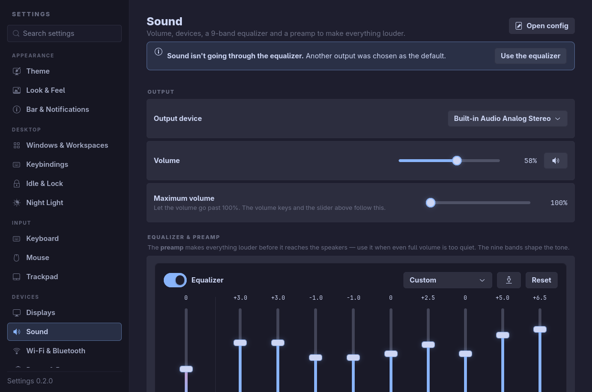
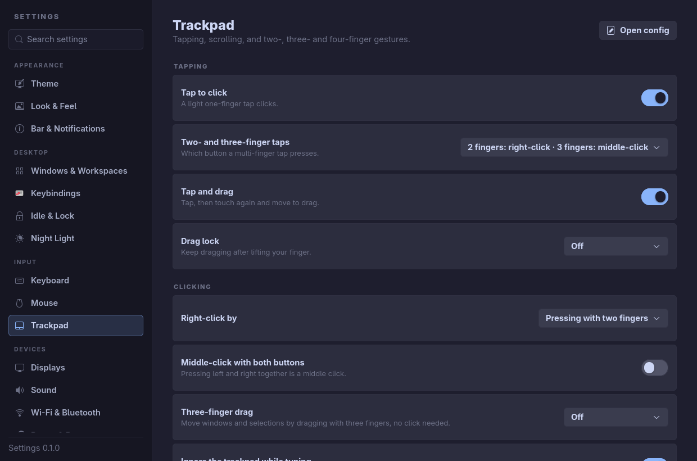
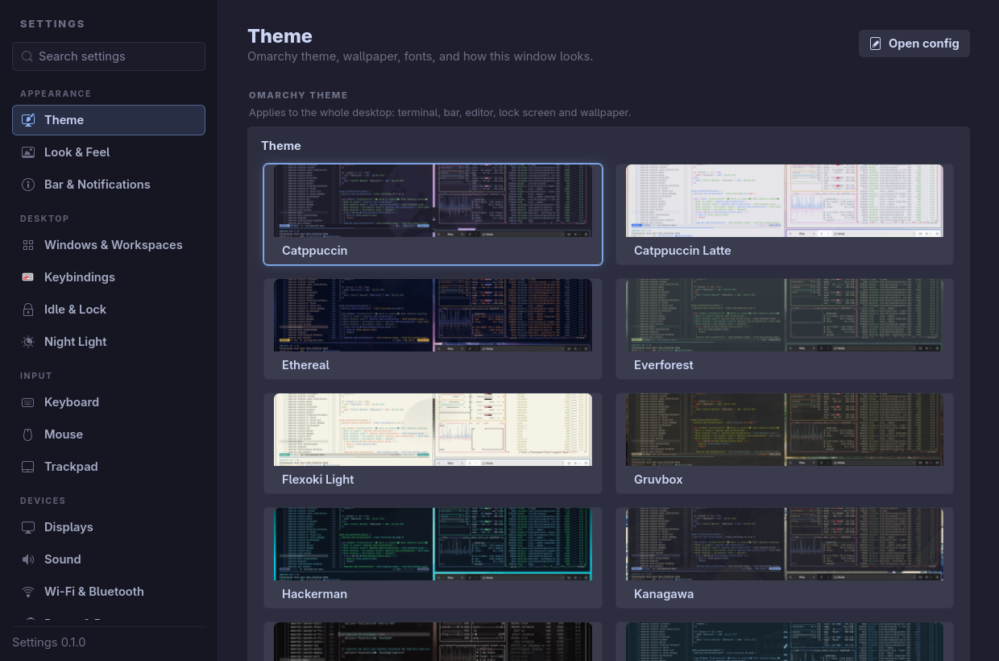
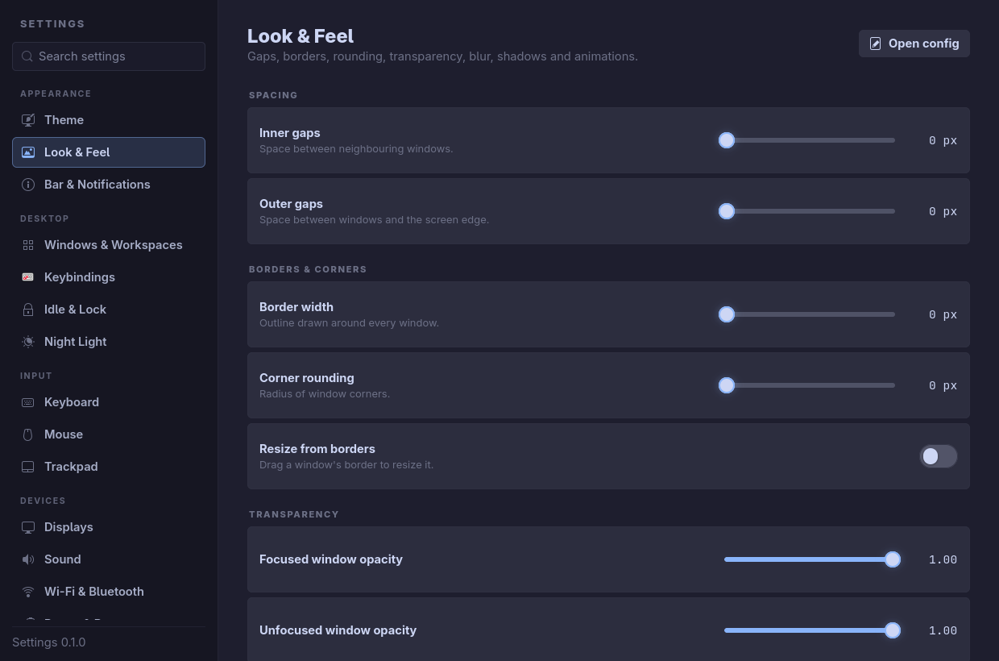
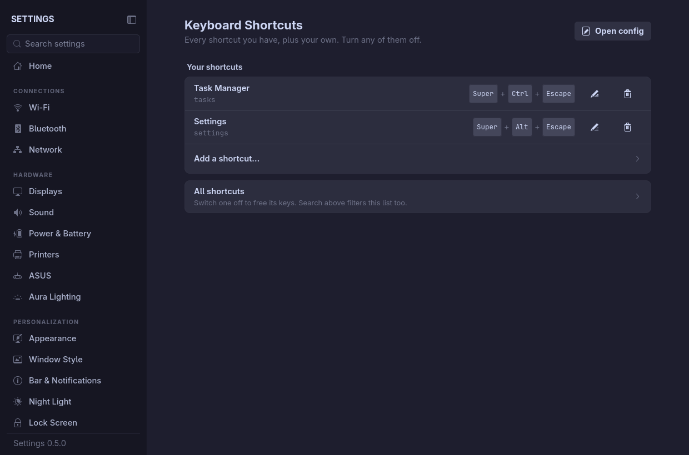

# Omarchy Settings

A native control panel for [Omarchy](https://omarchy.org). One clean, searchable
window for everything you'd otherwise change by editing Lua files. It looks and
feels like the [Strata](https://github.com/lgse/strata) file manager.



```sh
curl -fsSL https://raw.githubusercontent.com/design-nexus/omarchy-settings/main/install.sh | bash
```

## Features

- **Organised and searchable**: pages are grouped into Appearance, Desktop, Input,
  Devices and System, and <kbd>Ctrl</kbd>+<kbd>F</kbd> searches every setting on
  every page.
- **Open config** on every page opens the underlying file in your default editor.
- **Themes**: Dracula, Catppuccin (Mocha, Macchiato, Frappé, Latte), Tokyo Night
  (Night, Storm, Moon), One Dark Pro, Nord, Gruvbox, Rosé Pine, Everforest,
  Solarized and Kanagawa. Or **Follow Omarchy**, which restyles live whenever you
  change the desktop theme.
- **Sound**:
  - a **9-band equalizer** (31 Hz–8 kHz) with presets;
  - a separate **preamp** of up to +24 dB, with a limiter so loud audio doesn't
    distort — for when full volume is still too quiet;
  - **maximum volume** up to 150%, which the volume keys respect.
- **Trackpad**:
  - tap to click, and choosing which button a 2- or 3-finger tap presses;
  - 3-finger drag, and natural or reversed scrolling;
  - a **3- and 4-finger gesture editor**: pick what each swipe left/right/up/down
    and pinch in/out does, with **reverse left/right** and **reverse up/down**;
  - **looping workspace swipes**: the smooth, finger-tracking swipe continues
    from 5 back to 1, and from 1 to 5.
- **Everything else**:
  - look & feel: gaps, borders, rounding, opacity, blur, shadows, animations,
    cursor;
  - windows and workspaces, keybindings (add your own, switch any off), idle &
    lock, and a night light schedule;
  - keyboard layouts and Caps Lock, mouse settings (per-device too), and
    displays (with a 15-second "keep these settings?" safety revert);
  - Wi-Fi & Bluetooth, power profiles and brightness, ASUS laptops (via
    `asusctl`), default apps, plugins, and updates.

| Trackpad gestures | Themes |
| --- | --- |
|  |  |
| **Look & Feel** | **Keybindings** |
|  |  |

## Install

**One line** (downloads the latest release, or builds from source if there
isn't a prebuilt one for your machine):

```sh
curl -fsSL https://raw.githubusercontent.com/design-nexus/omarchy-settings/main/install.sh | bash
```

To also add a gear button to the Omarchy bar (left-click opens Settings,
right-click opens Sound):

```sh
curl -fsSL https://raw.githubusercontent.com/design-nexus/omarchy-settings/main/install.sh | bash -s -- --gear
```

**From source:**

```sh
git clone https://github.com/design-nexus/omarchy-settings.git
cd omarchy-settings
./install.sh          # add --gear for the bar button
```

Everything installs into your home directory (`~/.local/bin/settings`, plus a
launcher entry and icon). Nothing needs root, except installing Rust if you
build from source and don't have it.

**Optional:** `sudo pacman -S lsp-plugins-lv2` adds the limiter that lets the
preamp go up to +24 dB safely. Without it, the preamp is capped lower.

### Requirements

Omarchy 4 (Hyprland 0.56+ with Lua config), GTK 4.18+, and PipeWire. These are
all part of a standard Omarchy install.

## Usage

Open **Settings** from the app launcher, or run `settings`.

| Command | What it does |
| --- | --- |
| `settings` | Open the window |
| `settings --section audio` | Open (or jump) to a page: `theme`, `look`, `trackpad`, `audio`, `displays`, `keybindings`, … |
| `settings --eq on\|off\|toggle\|status` | Turn the preamp and equalizer on or off, e.g. from a keybinding |
| `settings --volume raise\|lower\|+N\|-N` | Change volume, going past 100% up to the maximum set in Sound |
| `settings --apply` | Regenerate the Hyprland file from saved settings |

## How it changes your config

Settings never parses or rewrites your own config files:

- **Hyprland**: every value you change goes into one generated file,
  `~/.config/hypr/settings.lua`, which your `hyprland.lua` loads last. The
  `require` line is added the first time you change something. Each row has a
  reset button that hands the value back to your own config or Omarchy's
  default.
- **Saved state**: `~/.config/settings/state.json`. The generated file is always
  rebuilt from this.
- **Equalizer**: a PipeWire filter-chain running in its own client
  (`~/.config/pipewire/settings-eq.conf`, the `settings-eq` user service). Its
  sink feeds your speakers, and Omarchy's volume keys still control real
  loudness.
- **Omarchy features** (themes, fonts, the bar, idle, night light, default apps,
  plugins) are changed through Omarchy's own commands and config.

**Gestures:** Settings only defines gestures once you switch on *Manage swipe
gestures here*. If another file already defines gestures for the same fingers
and direction, Settings warns you and can switch those off (with a backup).
With *Loop around* on, Settings keeps two hidden placeholder workspaces, one
before 1 and one after the last. Swipes slide into them, then jump to the
other end of the loop.

## Replacing older settings panels

If OmaSettings, Omarchy Control Panel or the older `design-nexus.settings` plugin
is installed, Settings offers once to remove them, since they compete for the same
values. It lists every file and line it will touch first, imports nothing, and
backs everything up to `~/.config/settings/old-panels-backup-*`. If Hyprland reports
errors afterwards, it restores the backup automatically. You can also restore
later from **Settings App → Restore**.

## Custom themes

Drop a TOML file in `~/.config/settings/themes/`:

```toml
name = "My Theme"
bg = "#1a1b26"
surface = "#16161e"
text = "#c0caf5"
dim_text = "#565f89"
accent = "#7aa2f7"
border = "#292e42"
muted = "#3b4261"
highlight = "#283457"
danger = "#f7768e"
glow = "#7aa2f7"
shadow = "#0f0f14"
light = false
```

## Uninstall

```sh
curl -fsSL https://raw.githubusercontent.com/design-nexus/omarchy-settings/main/uninstall.sh | bash
```

Add `-s -- --purge` to also remove everything Settings configured: its
Hyprland file and the line that loads it, the equalizer service, and its saved
settings.

## Development

```sh
cargo run -- --section trackpad
cargo test
cargo clippy -- -D warnings
```

It's built with Rust and gtk4-rs, and doesn't use libadwaita. Each sidebar page
is one file in `src/sections/`, and the Hyprland, audio and cleanup logic lives in
`src/backend/`.

## License

[MIT](LICENSE) © Ken Smith
