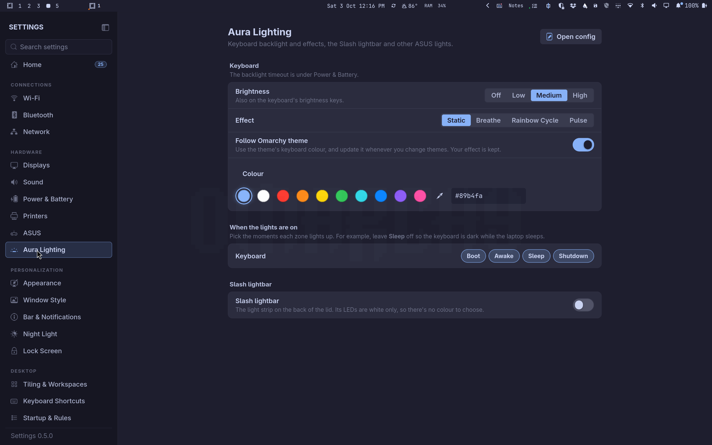
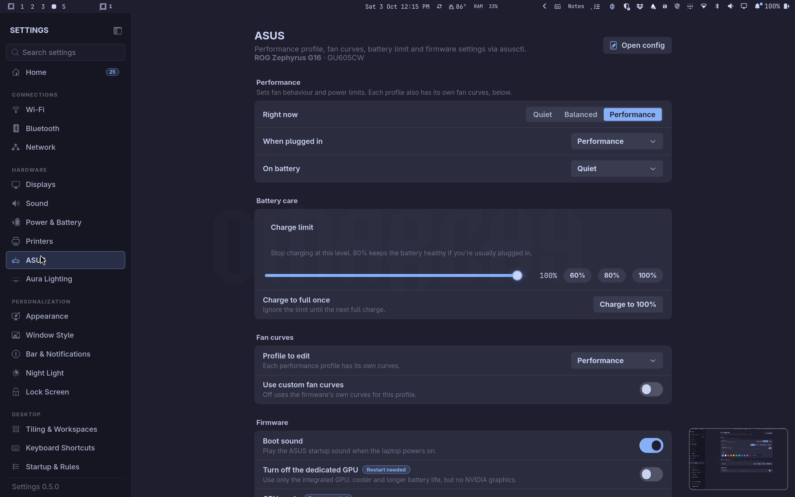
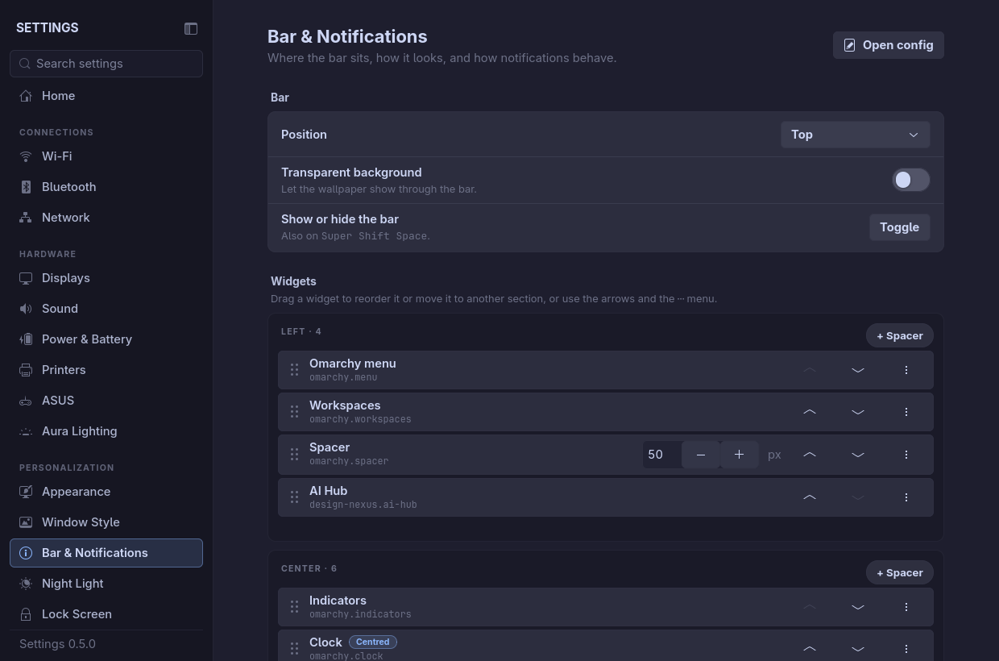

# Omarchy Settings

A native control panel for [Omarchy](https://omarchy.org). One clean, searchable
window for everything you'd otherwise change by editing Lua files.


```sh
curl -fsSL https://raw.githubusercontent.com/design-nexus/omarchy-settings/main/install.sh | bash
```

## Features

- **Organised and searchable**: pages are grouped into Appearance, Desktop, Input,
  Devices and System, and <kbd>Ctrl</kbd>+<kbd>F</kbd> searches every setting on
  every page.
- **Open config** on every page opens the underlying file in your default editor.
- **Apps follow the theme**: GTK, libadwaita, Qt and KDE windows and dialogs
  take the Omarchy theme's colours (through
  [hyprchroma](https://github.com/NobleDoodle/hyprchroma), if installed), plus
  the interface font and an icon theme that stays put when you change themes.
- **Units**: show temperatures in °C or °F (Theme → This window).
- **Themes**: Dracula, Catppuccin (Mocha, Macchiato, Frappé, Latte), Tokyo Night
  (Night, Storm, Moon), One Dark Pro, Nord, Gruvbox, Rosé Pine, Everforest,
  Solarized and Kanagawa. Or **Follow Omarchy**, which restyles live whenever you
  change the desktop theme.
- **Sound**:
  - a **9-band equalizer** (31 Hz–8 kHz) with presets;
  - a separate **preamp** of up to +24 dB, with a limiter so loud audio doesn't
    distort — for when full volume is still too quiet;
  - **maximum volume** up to 150%, which the volume keys respect.
- **Trackpad**:
  - tap to click, and choosing which button a 2- or 3-finger tap presses;
  - 3-finger drag, and natural or reversed scrolling;
  - a **3- and 4-finger gesture editor**: pick what each swipe left/right/up/down
    and pinch in/out does, with **reverse left/right** and **reverse up/down**;
  - **looping workspace swipes**: the smooth, finger-tracking swipe continues
    from 5 back to 1, and from 1 to 5.
- **Bar layout**: drag widgets to reorder them or move them between the left,
  center and right sections; add widgets, remove them, and add as many
  **spacers** as you like, each with its own width.
- **No hand-offs**: Wi-Fi (join, disconnect, forget, connection details),
  Bluetooth (find, pair, connect, forget), per-app volume and output,
  notification history with Do not disturb, and lock / suspend / log out /
  restart / shut down all work inside Settings instead of opening a panel.
- **Everything else**:
  - look & feel: gaps, borders, rounding, opacity, blur, shadows, animations,
    cursor;
  - windows and workspaces, keybindings (add your own, switch any off), idle &
    lock, and a night light schedule;
  - keyboard layouts and Caps Lock, mouse settings (per-device too), and
    displays (with a 15-second "keep these settings?" safety revert);
  - Wi-Fi & Bluetooth, power profiles and brightness, default apps, plugins,
    and updates.
- **Extensions** for more devices, installed from GitHub in one click
  (Settings → Extensions). Each adds its own pages under Devices, only when
  matching hardware is found:
  - **ASUS** (needs `asusctl`): performance profiles, battery charge limit, a
    **fan curve graph** you drag (per profile and fan, with presets), firmware
    settings such as GPU mode and panel overdrive, and CPU/GPU power limits. Plus
    **Aura Lighting**: effects, an inline colour picker, **Follow Omarchy theme**
    (keeps your effect across theme changes), which power states light the
    keyboard, the **Slash lightbar**, AniMe Matrix, XG Mobile light and drive lights.
  - **Logitech**: battery, pointer speed, scrolling, buttons, backlight,
    Easy-Switch and lighting for Logitech mice and keyboards.
  - **Headsets** (needs `headsetcontrol`): battery, sidetone, lights, EQ presets,
    auto power-off.
  - **Webcams** (needs `v4l2-ctl`): zoom, pan/tilt, focus, exposure, white
    balance, with framing presets for OBSBOT cameras.

  Anyone can write one: see
  [settings-extensions](https://github.com/design-nexus/settings-extensions).
- **Updates**: Settings checks GitHub once a day when it opens. A new version is
  offered on Updates & About (one click, then restart); extensions show "Update
  available" and can update together, or automatically if you switch that on.
  `settings --update` does the same from a terminal (`--check` only reports).
- **Keyboard backlight timeout** (any laptop with a keyboard backlight): turn it
  off after a set time without typing or touching the trackpad, and back on with
  the next key press.

| Trackpad gestures | Themes |
| --- | --- |
|  |  |
| **Look & Feel** | **Keybindings** |
|  |  |
| **Aura Lighting** (ASUS extension) | **ASUS** performance, fans and firmware (ASUS extension) |
|  |  |
| **Bar layout** | |
|  | |

## Install

**One line** (downloads the latest release, or builds from source if there
isn't a prebuilt one for your machine):

```sh
curl -fsSL https://raw.githubusercontent.com/design-nexus/omarchy-settings/main/install.sh | bash
```

To also add a gear button to the Omarchy bar (left-click opens Settings,
right-click opens Sound):

```sh
curl -fsSL https://raw.githubusercontent.com/design-nexus/omarchy-settings/main/install.sh | bash -s -- --gear
```

**From source:**

```sh
git clone https://github.com/design-nexus/omarchy-settings.git
cd omarchy-settings
./install.sh          # add --gear for the bar button
```

Everything installs into your home directory (`~/.local/bin/settings`, plus a
launcher entry and icon). Nothing needs root, except installing Rust if you
build from source and don't have it.

**Optional:** `sudo pacman -S lsp-plugins-lv2` adds the limiter that lets the
preamp go up to +24 dB safely. Without it, the preamp is capped lower.

### Requirements

Omarchy 4 (Hyprland 0.56+ with Lua config), GTK 4.18+, and PipeWire. These are
all part of a standard Omarchy install.

## Usage

Open **Settings** from the app launcher, or run `settings`.

| Command | What it does |
| --- | --- |
| `settings` | Open the window |
| `settings --section audio` | Open (or jump) to a page: `theme`, `look`, `trackpad`, `audio`, `displays`, `keybindings`, … |
| `settings --eq on\|off\|toggle\|status` | Turn the preamp and equalizer on or off, e.g. from a keybinding |
| `settings --volume raise\|lower\|+N\|-N` | Change volume, going past 100% up to the maximum set in Sound |
| `settings --kbd-timeout 30\|off` | Turn the keyboard backlight off after 30 idle seconds (or stop doing that) |
| `settings --apply` | Regenerate the Hyprland file from saved settings |

## How it changes your config

Settings never parses or rewrites your own config files:

- **Hyprland**: every value you change goes into one generated file,
  `~/.config/hypr/settings.lua`, which your `hyprland.lua` loads last. The
  `require` line is added the first time you change something. Each row has a
  reset button that hands the value back to your own config or Omarchy's
  default.
- **Saved state**: `~/.config/settings/state.json`. The generated file is always
  rebuilt from this.
- **Keyboard backlight timeout**: a small user service, `settings-kbd-idle`, that
  asks the compositor when there's been no input (the Wayland idle-notify
  protocol). It exists only while a timeout is set.
- **Equalizer**: a PipeWire filter-chain running in its own client
  (`~/.config/pipewire/settings-eq.conf`, the `settings-eq` user service). Its
  sink feeds your speakers, and Omarchy's volume keys still control real
  loudness.
- **App theming**: Settings drives hyprchroma's own commands and never edits
  GTK or KDE files itself. The interface font and icon theme are the usual GNOME
  settings (`gsettings`). If you pick your own icons, a theme-set hook,
  `~/.config/omarchy/hooks/theme-set.d/50-settings-theme`, puts them back after
  each theme change. It also tells extensions that ask, so the ASUS extension
  can restore your keyboard lighting.
- **Extensions** live in `~/.local/share/settings/extensions/<id>` (a git
  checkout each). Settings runs each one's helper program and draws the page;
  each can be turned off without removing it (its pages are hidden), and
  `settings --ext list|install|update|enable|disable|remove` does the same from
  a terminal.
- **Omarchy features** (themes, fonts, the bar, idle, night light, default apps,
  plugins) are changed through Omarchy's own commands and config.

**Gestures:** Settings only defines gestures once you switch on *Manage swipe
gestures here*. If another file already defines gestures for the same fingers
and direction, Settings warns you and can switch those off (with a backup).
With *Loop around* on, Settings keeps two hidden placeholder workspaces, one
before 1 and one after the last. Swipes slide into them, then jump to the
other end of the loop.

## Custom themes

Drop a TOML file in `~/.config/settings/themes/`:

```toml
name = "My Theme"
bg = "#1a1b26"
surface = "#16161e"
text = "#c0caf5"
dim_text = "#565f89"
accent = "#7aa2f7"
border = "#292e42"
muted = "#3b4261"
highlight = "#283457"
danger = "#f7768e"
glow = "#7aa2f7"
shadow = "#0f0f14"
light = false
```

## Uninstall

```sh
curl -fsSL https://raw.githubusercontent.com/design-nexus/omarchy-settings/main/uninstall.sh | bash
```

This removes the app, the keyboard backlight timeout service, and the theme-set
hook. These all run the app, so they can't stay behind without it. Your
settings are kept, so reinstalling brings the timeout back.

Add `-s -- --purge` to also remove everything Settings configured: its
Hyprland file and the line that loads it, the equalizer service, and its saved
settings.

## Development

```sh
cargo run -- --section trackpad
cargo test
cargo clippy -- -D warnings
```

It's built with Rust and gtk4-rs, and doesn't use libadwaita. Each sidebar page
is one file in `src/sections/`, and the Hyprland and audio logic lives in
`src/backend/`.

## License

[MIT](LICENSE) © Ken Smith
